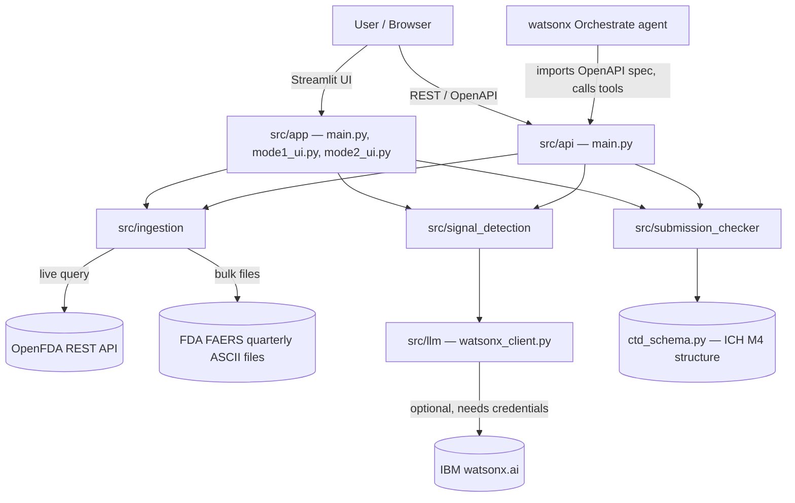

# Architecture

## System Architecture

Two entry points (Streamlit UI, FastAPI service) sit on top of the same shared Python packages — neither mode's logic is duplicated between them.

## Components

| Component | Technology | Responsibility |
|---|---|---|
| `src/app/` | Streamlit | Two-tab dashboard: Signal Detector, Submission Checker |
| `src/api/` | FastAPI | `/signals/detect` and `/submission/check` REST endpoints with auto-generated OpenAPI spec, for watsonx Orchestrate |
| `src/ingestion/` | requests, pandas | `openfda_client.py` (live OpenFDA API, paginated) and `faers_loader.py` (bulk FAERS quarterly ASCII files) — both converge on one shared schema: `(report_id, drug, reaction, serious)` |
| `src/signal_detection/` | numpy, pandas | `prr.py` / `ror.py` — vectorized contingency-table statistics over the whole dataset; `signal_reporter.py` — risk banding + explanations |
| `src/submission_checker/` | PyPDF2, python-docx, re | `document_parser.py` — text extraction + heading detection; `ctd_schema.py` — ICH M4 reference structure; `gap_analyzer.py` — completeness scoring |
| `src/llm/` | ibm-watsonx-ai | Optional plain-language explanation generation; fails gracefully to a template when credentials are absent |
| `data/` | — | Local landing zone for downloaded FAERS bulk files (not committed — see `.gitignore`) |

## Data Flow

**Signal Detector:**
1. User submits a drug name (UI) or `POST /signals/detect` (API) with `drug_name`, `n_records`, `use_llm`.
2. `ingestion.openfda_client.fetch_faers_sample` pages through OpenFDA (500 records/call anonymously — the documented 1000/call ceiling requires an API key) and flattens results to one row per `(report, drug, reaction)`.
3. `signal_detection.prr.calculate_prr` builds contingency counts for every pair in one vectorized pass and computes PRR + chi-squared.
4. `signal_detection.signal_reporter.build_signal_report` adds a risk band and an explanation (template or watsonx.ai) per flagged pair.
5. The caller (UI or API) filters the result to the specific drug that was searched before displaying it.

**Submission Checker:**
1. User uploads a file (UI) or `POST /submission/check` (API, multipart).
2. `submission_checker.document_parser.extract_text` pulls raw text out of the PDF/DOCX/TXT.
3. `detect_section_numbers` finds heading-shaped section numbers (line-anchored, tolerant of PDF line-break loss and the ICH trailing-period convention).
4. `submission_checker.gap_analyzer.analyze_document` cross-references detected headings against `CTD_SCHEMA`, returning per-module and overall completeness plus a missing-sections list.

## Security Considerations

- No credentials are hardcoded anywhere in source; `WATSONX_API_KEY` / `WATSONX_PROJECT_ID` / `OPENFDA_API_KEY` are read from environment variables via `.env` (see `.env.example`), and `.env` is git-ignored.
- The watsonx.ai client (`llm/watsonx_client.py`) raises a typed `WatsonxConfigError` rather than crashing when credentials are missing, and calling code catches it to fall back to templates — no partial/undefined state.
- No client data, patient-identifiable information, or social-media-sourced data is used anywhere — only public FDA FAERS/OpenFDA data (already de-identified) and public ICH/EMA guideline structure.

## Scalability Notes

The PRR engine is the part most likely to matter at scale: it's implemented as a single vectorized pass over contingency counts (`groupby` + numpy array math) rather than a per-pair loop, so it stays tractable well beyond a single OpenFDA pull — the same code path was designed to also work against a full downloaded FAERS quarterly file (millions of rows) via `ingestion.faers_loader`, not just the live API sample. The FastAPI service is stateless, so it can be horizontally scaled behind a load balancer if it were ever deployed beyond the hackathon; OpenFDA's own per-call latency (10-20s for a 500-record page) is the actual bottleneck, not our code.
